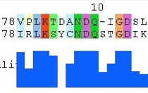

The BioJava - Alignment Module
=====================================================

A tutorial for the alignment module of [BioJava](http://www.biojava.org).

## About
<table>
    <tr>
        <td>
            
        </td>
        <td>
            The <i>alignment</i> module of BioJava provides an API that contains
            <ul>
                <li>Implementations of dynamic programming algorithms for sequence alignment</li>
                <li>Reading and Writing of popular alignment file formats</li>
                <li>A single-, or multi- threaded multiple sequence alignment algorithm.</li>
            </ul>

        </td>
    </tr>
</table>   

## Index

This tutorial is split into several chapters.

Chapter 1 - Quick [Installation](installation.md)

Chapter 2 - Global alignment - Needleman and Wunsch algorithm

Chapter 3 - Local alignment - Smith-Waterman algorithm

Chapter 4 - Multiple Sequence alignment

Chapter 5 - Reading and writing of multiple alignments

Chapter 6 - BLAST - why you don't need BioJava for parsing BLAST

## Please cite

**BioJava: an open-source framework for bioinformatics in 2012** 
*Andreas Prlic; Andrew Yates; Spencer E. Bliven; Peter W. Rose; Julius Jacobsen; Peter V. Troshin; Mark Chapman; Jianjiong Gao; Chuan Hock Koh; Sylvain Foisy; Richard Holland; Gediminas Rimsa; Michael L. Heuer; H. Brandstatter-Muller; Philip E. Bourne; Scooter Willis*  
[Bioinformatics (2012) 28 (20): 2693-2695.](http://bioinformatics.oxfordjournals.org/content/28/20/2693.abstract)  
doi: 10.1093/bioinformatics/bts494

## License

The content of this tutorial is available under the [CC-BY](http://creativecommons.org/licenses/by/3.0/) license.

[view license](../license.md)

<!--automatically generated footer-->

---

Navigation:
[Home](../README.md)
| Book 2: The Alignment module

Prev: [Book 1: The Core module](../core/README.md)

Next: [Book 3: The Protein Structure modules](../structure/README.md)
