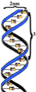

The BioJava - Core Module
=====================================================

A tutorial for the core module of [BioJava](http://www.biojava.org).

## About
<table>
    <tr>
        <td>
            
        </td>
        <td>
            The <i>core</i> module of BioJava provides an API that provides
            <ul>
                <li>Basic operations with biological sequences</li>
                <li>Reading and Writing of popular sequence file formats</li>
                <li>Translate DNA sequences into protein sequences</li>                
            </ul>
        </td>
    </tr>
</table>   

## Index

This tutorial is split into several chapters.

Chapter 1 - Quick [Installation](installation.md)

Chapter 2 - [Basic Sequence types](sequences.md)

Chapter 3 - [Reading and Writing sequences](readwrite.md)

Chapter 4 - [Translating](translating.md) DNA and protein sequences.

## Please cite

**BioJava: an open-source framework for bioinformatics in 2012** 
*Andreas Prlic; Andrew Yates; Spencer E. Bliven; Peter W. Rose; Julius Jacobsen; Peter V. Troshin; Mark Chapman; Jianjiong Gao; Chuan Hock Koh; Sylvain Foisy; Richard Holland; Gediminas Rimsa; Michael L. Heuer; H. Brandstatter-Muller; Philip E. Bourne; Scooter Willis*  
[Bioinformatics (2012) 28 (20): 2693-2695.](http://bioinformatics.oxfordjournals.org/content/28/20/2693.abstract)  
 

## License

The content of this tutorial is available under the [CC-BY](http://creativecommons.org/licenses/by/3.0/) license.

[view license](../license.md)

<!--automatically generated footer-->

---

Navigation:
[Home](../README.md)
| Book 1: The Core Module

Next: [Book 2: The Alignment Module](../alignment/README.md)
