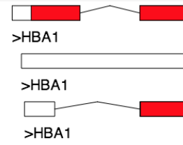

The BioJava - Genomics Module
=====================================================

A tutorial for the genomics module of [BioJava](http://www.biojava.org)

## About
<table>
    <tr>
        <td>
            
        </td>
        <td>
            The <i>genome</i> module of BioJava provides an API that allows to
            <ul>
                <li>Parse popular file formats used in genomcs</li>
                <li>Convert from one file format to another</li>
                <li>Translate DNA sequences into protein sequences</li>                
            </ul>

        </td>
    </tr>
</table>   

## Index

This tutorial is split into several chapters.

Chapter 1 - Quick [Installation](installation.md)

Chapter 2 - Reading [gene names information](genenames.md) from genenames.org

Chapter 3 - Reading [chromosomal positions](chromosomeposition.md) for genes. (UCSC's refFlat.txt.gz )

Chapter 4 - Reading [GTF and GFF files](gff.md)

Chapter 5 - Reading and writing a [Genebank](genebank.md) file

Chapter 5 - Reading [karyotype (cytoband)](karyotype.md) files

Chapter 6 - Reading genomic DNA sequences using UCSC's [.2bit file format](twobit.md)

## Please cite

**BioJava: an open-source framework for bioinformatics in 2012** 
*Andreas Prlic; Andrew Yates; Spencer E. Bliven; Peter W. Rose; Julius Jacobsen; Peter V. Troshin; Mark Chapman; Jianjiong Gao; Chuan Hock Koh; Sylvain Foisy; Richard Holland; Gediminas Rimsa; Michael L. Heuer; H. Brandstatter-Muller; Philip E. Bourne; Scooter Willis*  
[Bioinformatics (2012) 28 (20): 2693-2695.](http://bioinformatics.oxfordjournals.org/content/28/20/2693.abstract)  
 

## License

The content of this tutorial is available under the [CC-BY](http://creativecommons.org/licenses/by/3.0/) license.

[view license](../license.md)

<!--automatically generated footer-->

---

Navigation:
[Home](../README.md)
| Book 4: The Genomics Module

Prev: [Book 3: The Structure modules](../structure/README.md)
