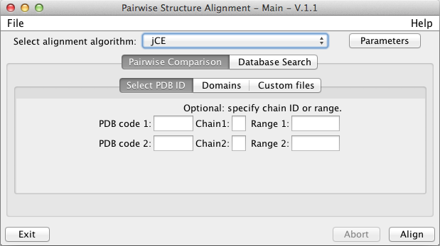
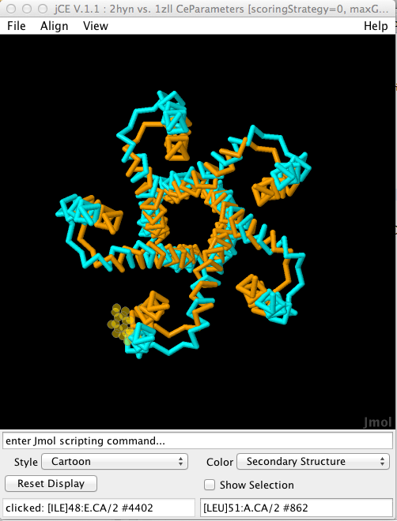
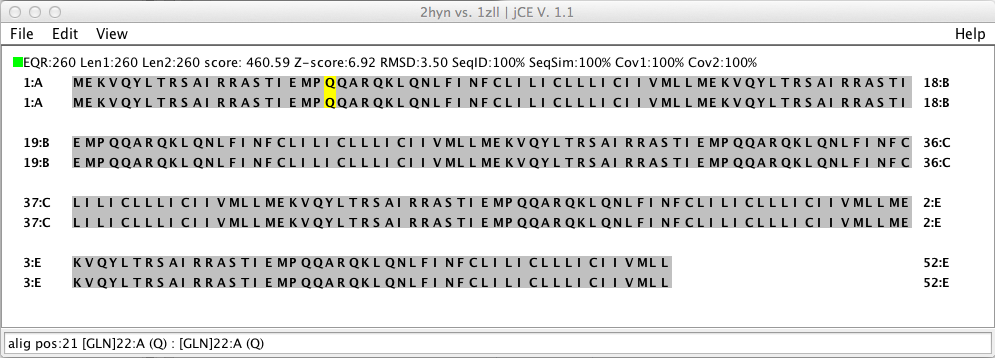
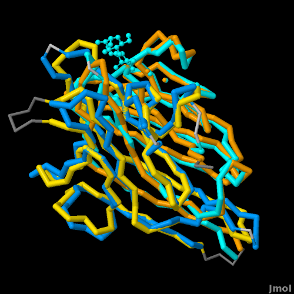
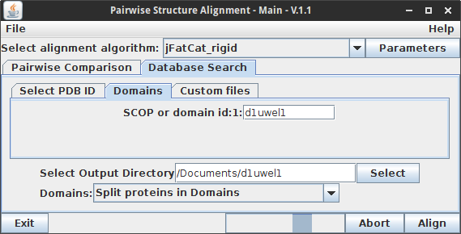
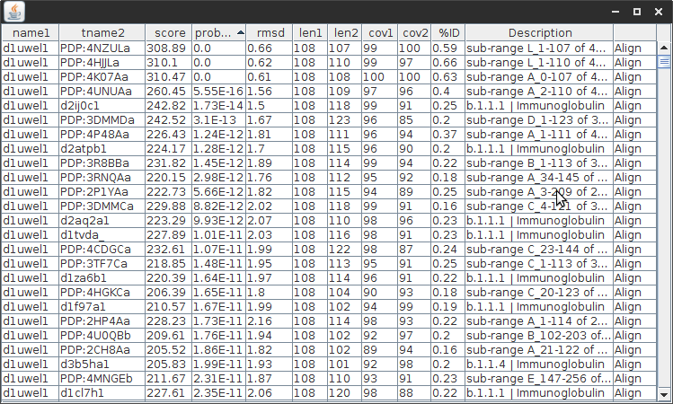

Protein Structure Alignment
===========================

## What is a structure alignment?

A **Structural alignment** attempts to establish equivalences between two or more polymer structures based on their shape and three-dimensional conformation. In contrast to simple structural superposition (see below), where at least some equivalent residues of the two structures are known, structural alignment requires no a priori knowledge of equivalent positions.

Structural alignment is a valuable tool for the comparison of proteins with low sequence similarity, where evolutionary relationships between proteins cannot be easily detected by standard sequence alignment techniques. Structural alignment can therefore be used to imply evolutionary relationships between proteins that share very little common sequence. However, caution should be exercised when using the results as evidence for shared evolutionary ancestry, because of the possible confounding effects of convergent evolution by which multiple unrelated amino acid sequences converge on a common tertiary structure.

For more info see the Wikipedia article on [protein structure alignment](http://en.wikipedia.org/wiki/Structural_alignment).

## Alignment Algorithms supported by BioJava

BioJava comes with a number of algorithms for aligning structures. The following
five options are displayed by default in the graphical user interface (GUI),
although others can be accessed programmatically using the methods in
[StructureAlignmentFactory](http://www.biojava.org/docs/api/org/biojava/nbio/structure/align/StructureAlignmentFactory.html).

1. Combinatorial Extension (CE)
2. Combinatorial Extension with Circular Permutation (CE-CP)
3. FATCAT - rigid
4. FATCAT - flexible.
5. Smith-Waterman superposition

CE and FATCAT both use structural similarity to align the proteins, while
Smith-Waterman performs a local sequence alignment and then displays the result
in 3D. See below for descriptions of the algorithms.

## Alignment User Interface

Before going the details how to use the algorithms programmatically, let's take
a look at the user interface that cames with the *biojava-structure-gui* module.

```java
AlignmentGui.getInstance();
```

This code shows the following user interface:



You can manually select protein chains, domains, or custom files to be aligned.
Try to align 2hyn vs. 1zll. This will show the results in a graphical way, in
3D:



and also a 2D display, that interacts with the 3D display



The functionality to perform and visualize these alignments can of course be
used also from your own code. Let's first have a look at the alignment
algorithms.

## The Alignment Algorithms

### Combinatorial Extension (CE)

The Combinatorial Extension (CE) algorithm was originally developed by
[Shindyalov and Bourne in
1998](http://peds.oxfordjournals.org/content/11/9/739.short) [](http://www.ncbi.nlm.nih.gov/pubmed/9796821).
It works by identifying segments of the two proteins with similar local
structure, and then combining those to try to align the most residues possible
while keeping the overall RMSD of the superposition low.

CE is a rigid-body alignment algorithm, which means that the structures being
compared are kept fixed during superposition. In some cases it may be desirable
to break large proteins up into domains prior to aligning them (by manually
inputing a subrange, using the [SCOP or CATH databases](externaldb.md), or by
decomposing the protein automatically using the [Protein Domain
Parser](http://www.biojava.org/docs/api/org/biojava/nbio/structure/domain/LocalProteinDomainParser.html)
algorithm).

BioJava class: [org.biojava.bio.structure.align.ce.CeMain](http://www.biojava.org/docs/api/org/biojava/nbio/structure/align/ce/CeMain.html)

### Combinatorial Extension with Circular Permutation (CE-CP)

CE and FATCAT both assume that aligned residues occur in the same order in both
proteins (e.g. they are both *sequence-order dependent* algorithms). In proteins
related by a circular permutation, the N-terminal part of one protein is related
to the C-terminal part of the other, and vice versa. CE-CP allows circularly
permuted proteins to be compared.  For more information on circular
permutations, see the
[Wikipedia](http://en.wikipedia.org/wiki/Circular_permutation_in_proteins) or
[Molecule of the
Month](http://www.pdb.org/pdb/101/motm.do?momID=124&evtc=Suggest&evta=Moleculeof%20the%20Month&evtl=TopBar)
articles [](http://www.ncbi.nlm.nih.gov/pubmed/22496628).


For proteins without a circular permutation, CE-CP results look very similar to
CE results (with perhaps some minor differences and a slightly longer
calculation time). If a circular permutation is found, the two halves of the
proteins will be shown in different colors:



CE-CP was developed by Spencer E. Bliven, Philip E. Bourne, and Andreas Prli&#263;.

BioJava class: [org.biojava.bio.structure.align.ce.CeCPMain](http://www.biojava.org/docs/api/org/biojava/nbio/structure/align/ce/CeCPMain.html)

### FATCAT - rigid

This is a Java implementation of the original FATCAT algorithm by [Yuzhen Ye
&amp; Adam Godzik in
2003](http://bioinformatics.oxfordjournals.org/content/19/suppl_2/ii246.abstract)
[](http://www.ncbi.nlm.nih.gov/pubmed/14534198).
It performs similarly to CE for most proteins. The 'rigid' flavor uses a
rigid-body superposition and only considers alignments with matching sequence
order.

BioJava class: [org.biojava.bio.structure.align.fatcat.FatCatRigid](www.biojava.org/docs/api/org/biojava/nbio/structure/align/fatcat/FatCatRigid.html)

### FATCAT - flexible

FATCAT-flexible introduces 'twists' between different parts of the proteins
which are superimposed independently. This is ideal for proteins which undergo
large conformational shifts, where a global superposition cannot capture the
underlying similarity between domains. For instance, the structures of
calmodulin with and without calcium bound can be much better aligned with
FATCAT-flexible than with one of the rigid alignment algorithms. The downside of
this is that it can lead to additional false positives in unrelated structures.


BioJava class: [org.biojava.bio.structure.align.fatcat.FatCatFlexible](www.biojava.org/docs/api/org/biojava/nbio/structure/align/fatcat/FatCatFlexible.html)

### Smith-Waterman

This aligns residues based on Smith and Waterman's 1981 algorithm for local
*sequence* alignment [](http://www.ncbi.nlm.nih.gov/pubmed/7265238). No structural information is included in the alignment, so
this only works for proteins with significant sequence similarity. It uses the
Blosum65 scoring matrix.

The two structures are superimposed based on this alignment. Be aware that errors
locating gaps can lead to high RMSD in the resulting superposition due to a
small number of badly aligned residues. However, this method is faster than
the structure-based methods.

BioJava Class: [org.biojava.bio.structure.align.ce.CeCPMain](http://www.biojava.org/docs/api/org/biojava/nbio/structure/align/ce/CeCPMain.html)

### Other methods

The following methods are not presented in the user interface by default:

* [BioJavaStructureAlignment](http://www.biojava.org/docs/api/org/biojava/nbio/structure/align/BioJavaStructureAlignment.html)
  A structure-based alignment method able of returning multiple alternate
  alignments. It was written by Andreas Prli&#263; and based on the PSC++ algorithm
  provided by Peter Lackner.
* [CeSideChainMain](http://www.biojava.org/docs/api/org/biojava/nbio/structure/align/ce/CeSideChainMain.html)
  A variant of CE using CB-CB distances, which sometimes improves alignments in
  proteins with parallel sheets and helices.
* [OptimalCECPMain](http://www.biojava.org/docs/api/org/biojava/nbio/structure/align/ce/OptimalCECPMain.html)
  An alternate (much slower) algorithm for finding circular permutations.

Additional methods can be added by implementing the
[StructureAlignment](http://www.biojava.org/docs/api/org/biojava/nbio/structure/align/StructureAlignment.html)
interface.

## PDB-wide database searches

The Alignment GUI also provides functionality for PDB-wide structural searches.
This systematically compares a structure against a non-redundant set of all
other structures in the PDB at either a chain or a domain level. Representatives
are selected using the RCSB's clustering of proteins with 40% sequence identity,
as described
[here](http://www.rcsb.org/pdb/static.do?p=general_information/cluster/structureAll.jsp).
Domains are selected using either SCOP (when available) or the
ProteinDomainParser algorithm.



To perform a database search, select the 'Database Search' tab, then choose a
query structure based on PDB ID, SCOP domain id, or from a custom file. The
output directory will be used to store results. These consist of individual
alignments in compressed XML format, as well as a tab-delimited file of
similarity scores and statistics. The statistics are displayed in an interactive
results table, which allows the alignments to be sorted. The 'Align' column
allows individual alignments to be visualized with the alignment GUI.



Be aware that this process can be very time consuming. Before
starting a manual search, it is worth considering whether a pre-computed result
may be available online, for instance for
[FATCAT-rigid](http://www.rcsb.org/pdb/static.do?p=general_information/cluster/structureAll.jsp)
or [DALI](http://ekhidna.biocenter.helsinki.fi/dali/start). For custom files or
specific domains, a few optimizations can reduce the time for a database search.
Downloading PDB files is a considerable bottleneck. This can be solved by
downloading all PDB files from the [FTP
server](ftp://ftp.wwpdb.org/pub/pdb/data/structures/divided/pdb/) and setting
the `PDB_DIR` environmental variable. This operation sped up the search from
about 30 hours to less than 4 hours.


## Creating alignments programmatically

The various structure alignment algorithms in BioJava implement the
`StructureAlignment` interface, and are normally accessed through
`StructureAlignmentFactory`. Here's an example of how to create a CE-CP
alignment and print some information about it.

```java
// Fetch CA atoms for the structures to be aligned
String name1 = "3cna.A";
String name2 = "2pel";
AtomCache cache = new AtomCache();
Atom[] ca1 = cache.getAtoms(name1);
Atom[] ca2 = cache.getAtoms(name2);

// Get StructureAlignment instance
StructureAlignment algorithm  = StructureAlignmentFactory.getAlgorithm(CeCPMain.algorithmName);

// Perform the alignment
AFPChain afpChain = algorithm.align(ca1,ca2);

// Print text output
System.out.println(afpChain.toCE(ca1,ca2));
```

To display the alignment using Jmol, use:

```java
GuiWrapper.display(afpChain, ca1, ca2);
// Or StructureAlignmentDisplay.display(afpChain, ca1, ca2);
```

Note that these require that you include the structure-gui package and the Jmol
binary in the classpath at runtime.

## Command-line tools

Many of the alignment algorithms are available in the form of command line
tools. These can be accessed through the main methods of the StructureAlignment
classes. Tar bundles are also available with scripts for running
[CE and FATCAT](http://source.rcsb.org/jfatcatserver/download.jsp).

Example:
```bash
runCE.sh -pdb1 4hhb.A -pdb2 4hhb.B -show3d
```

Using the command line tool it is possible to run pairwise alignments, several
alignments in batch mode, or full database searches. Some additional parameters
are available which are not exposed in the GUI, such as outputting results to a
file in various formats.


## Acknowledgements

Thanks to P. Bourne, Yuzhen Ye and A. Godzik for granting permission to freely use and redistribute their algorithms.

<!--automatically generated footer-->

---

Navigation:
[Home](../README.md)
| [Book 3: The Protein Structure modules](README.md)
| Chapter 8 : Structure Alignments

Prev: [Chapter 7 : SEQRES and ATOM records](seqres.md)

Next: [Chapter 9 : Biological Assemblies](bioassembly.md)
