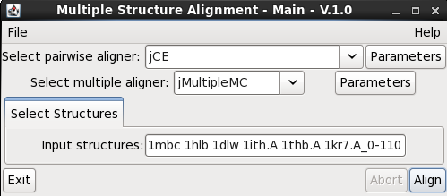
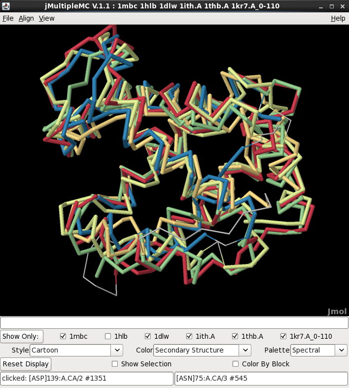
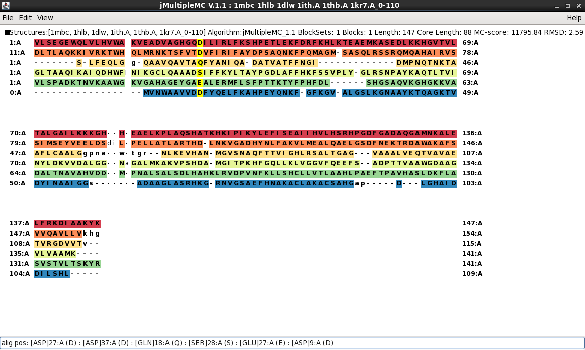
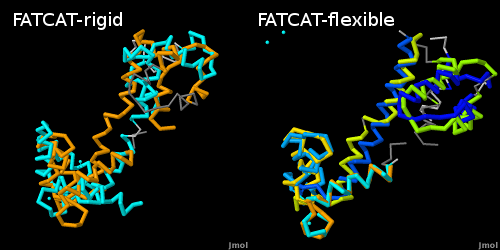

Structure Alignments
===========================

## What is a Structure Alignment?

A **structural alignment** attempts to establish equivalences between two or 
more polymer structures based on their shape and three-dimensional conformation. 
In contrast to simple structural superposition (see below), where at least some 
equivalent residues of the two structures are known, structural alignment requires 
no a priori knowledge of equivalent positions.

A **structural alignment** is a valuable tool for the comparison of proteins with 
low sequence similarity, where evolutionary relationships between proteins cannot 
be easily detected by standard sequence alignment techniques. Therefore, a 
**structural alignment** can be used to imply evolutionary relationships between 
proteins that share very little common sequence. However, caution should be exercised 
when using the results as evidence for shared evolutionary ancestry, because of the 
possible confounding effects of convergent evolution by which multiple unrelated amino 
acid sequences converge on a common tertiary structure.

A **structural alignment** of other biological polymers can also be made in BioJava.
For example, nucleic acids can be structurally aligned to find common structural motifs, 
independent of sequence similarity. This is specially important for RNAs, because their
3D structure arrangement is important for their function.

For more info see the Wikipedia article on [structure alignment](http://en.wikipedia.org/wiki/Structural_alignment).

## Alignment Algorithms Supported by BioJava

BioJava comes with a number of algorithms for aligning structures. The following
five options are displayed by default in the graphical user interface (GUI),
although others can be accessed programmatically using the methods in 
[StructureAlignmentFactory](http://www.biojava.org/docs/api/org/biojava/nbio/structure/align/StructureAlignmentFactory.html).

1. Combinatorial Extension (CE)
2. Combinatorial Extension with Circular Permutation (CE-CP)
3. FATCAT - rigid
4. FATCAT - flexible.
5. Smith-Waterman superposition

**CE** and **FATCAT** both use structural similarity to align the structures, while
**Smith-Waterman** performs a local sequence alignment and then displays the result
in 3D. See below for descriptions of the algorithms.

Since BioJava version 4.1.0, multiple structures can be compared at the same time in 
a **multiple structure alignment**, that can later be visualized in Jmol. 
The algorithm is described in detail below. As an overview, it uses any pairwise alignment 
algorithm and a **reference** structure to perform an alignment of all the structures.
Then, it runs a **Monte Carlo** optimization to determine the residue equivalencies among
all the structures, identifying conserved **structural motifs**.

## Alignment User Interface

Before going the details how to use the algorithms programmatically, let's take
a look at the user interface that comes with the *biojava-structure-gui* module.

### Pairwise Alignment GUI

Generating an instance of the GUI is just one line of code:

```java
AlignmentGui.getInstance();
```

This code shows the following user interface:


You can manually select structure chains, domains, or custom files to be aligned.
Try to align 2hyn vs. 1zll. This will show the results in a graphical way, in
3D:


and also a 2D display, that interacts with the 3D display


### Multiple Alignment GUI

Because of the inherent difference between multiple and pairwise alignments,
a separate GUI is used to trigger multiple structural alignments. Generating 
an instance of the GUI is analogous to the pairwise alignment GUI:

```java
MultipleAlignmentGUI.getInstance();
```

This code shows the following user interface:



The input format is a free text field, where the structure identifiers are 
indicated, space separated. A **structure identifier** is a String that
uniquely identifies a structure. It is basically composed of the pdbID, the
chain letters and the ranges of residues of each chain. For the formal description
visit [StructureIdentifier](http://www.biojava.org/docs/api/org/biojava/nbio/structure/StructureIdentifier.html).

As an example, a multiple structure alignment of 6 globins is shown here. 
Their structure identifiers are shown in the previous figure of the GUI.
The results are shown in a graphical way, as for the pairwise alignments:



The only difference with the Pairwise Alignment View is the possibility to show
a subset of structures to be visualized, by checking the boxes under the 3D
window and pressing the Show Only button afterwards.

A **sequence alignment panel** that interacts with the 3D display can also be shown.



Explore the coloring options in the *Edit* menu, and through the *View* menu for 
alternative representations of the alignment.

The functionality to perform and visualize these alignments can also be
used from your own code. Let's first have a look at the alignment algorithms.

## Pairwise Alignment Algorithms

### Combinatorial Extension (CE)

The Combinatorial Extension (CE) algorithm was originally developed by
[Shindyalov and Bourne in
1998](http://peds.oxfordjournals.org/content/11/9/739.short) [](http://www.ncbi.nlm.nih.gov/pubmed/9796821).
It works by identifying segments of the two structures with similar local
structure, and then combining those to try to align the most residues possible
while keeping the overall root-mean-square deviation (RMSD) of the superposition low.

CE is a rigid-body alignment algorithm, which means that the structures being
compared are kept fixed during superposition. In some cases it may be desirable
to break large proteins up into domains prior to aligning them (by manually
inputting a subrange, using the [SCOP or CATH databases](externaldb.md), or by
decomposing the protein automatically using the [Protein Domain
Parser](http://www.biojava.org/docs/api/org/biojava/nbio/structure/domain/LocalProteinDomainParser.html)
algorithm).

BioJava class: [org.biojava.bio.structure.align.ce.CeMain](http://www.biojava.org/docs/api/org/biojava/nbio/structure/align/ce/CeMain.html)

### Combinatorial Extension with Circular Permutation (CE-CP)

CE and FATCAT both assume that aligned residues occur in the same order in both
structures (e.g. they are both *sequence-order dependent* algorithms). In proteins
related by a circular permutation, the N-terminal part of one protein is related
to the C-terminal part of the other, and vice versa. CE-CP allows circularly
permuted proteins to be compared.  For more information on circular
permutations, see the
[Wikipedia](http://en.wikipedia.org/wiki/Circular_permutation_in_proteins) or
[Molecule of the Month](https://pdb101.rcsb.org/motm/124)
articles [](http://www.ncbi.nlm.nih.gov/pubmed/22496628).


For proteins without a circular permutation, CE-CP results look very similar to
CE results (with perhaps some minor differences and a slightly longer
calculation time). If a circular permutation is found, the two halves of the
proteins will be shown in different colors:


CE-CP was developed by Spencer E. Bliven, Philip E. Bourne, and Andreas Prli&#263;.

BioJava class: [org.biojava.nbio.structure.align.ce.CeCPMain](http://www.biojava.org/docs/api/org/biojava/nbio/structure/align/ce/CeCPMain.html)

### FATCAT - rigid

This is a Java implementation of the original FATCAT algorithm by [Yuzhen Ye
&amp; Adam Godzik in
2003](http://bioinformatics.oxfordjournals.org/content/19/suppl_2/ii246.abstract)
[](http://www.ncbi.nlm.nih.gov/pubmed/14534198).
It performs similarly to CE for most structures. The 'rigid' flavor uses a
rigid-body superposition and only considers alignments with matching sequence
order.

BioJava class: [org.biojava.nbio.structure.align.fatcat.FatCatRigid](https://www.biojava.org/docs/api/org/biojava/nbio/structure/align/fatcat/FatCatRigid.html)

### FATCAT - flexible

FATCAT-flexible introduces 'twists' between different parts of the structures
which are superimposed independently. This is ideal for proteins which undergo
large conformational shifts, where a global superposition cannot capture the
underlying similarity between domains. For instance, the structures of
calmodulin with and without calcium bound can be much better aligned with
FATCAT-flexible than with one of the rigid alignment algorithms. The downside of
this is that it can lead to additional false positives in unrelated structures.



BioJava class: [org.biojava.nbio.structure.align.fatcat.FatCatFlexible](https://www.biojava.org/docs/api/org/biojava/nbio/structure/align/fatcat/FatCatFlexible.html)

### Smith-Waterman

This aligns residues based on Smith and Waterman's 1981 algorithm for local
*sequence* alignment [](http://www.ncbi.nlm.nih.gov/pubmed/7265238). No structural information is included in the alignment, so
this only works for structures with significant sequence similarity. It uses the
Blosum65 scoring matrix.

The two structures are superimposed based on this alignment. Be aware that errors
locating gaps can lead to high RMSD in the resulting superposition due to a
small number of badly aligned residues. However, this method is faster than
the structure-based methods.

BioJava Class: [org.biojava.nbio.structure.align.ce.CeCPMain](http://www.biojava.org/docs/api/org/biojava/nbio/structure/align/ce/CeCPMain.html)

### Other methods

The following methods are not presented in the user interface by default:

* [BioJavaStructureAlignment](http://www.biojava.org/docs/api/org/biojava/nbio/structure/align/BioJavaStructureAlignment.html)
  A structure-based alignment method able of returning multiple alternate
  alignments. It was written by Andreas Prli&#263; and based on the PSC++ algorithm
  provided by Peter Lackner.
* [CeSideChainMain](http://www.biojava.org/docs/api/org/biojava/nbio/structure/align/ce/CeSideChainMain.html)
  A variant of CE using CB-CB distances, which sometimes improves alignments in
  proteins with parallel sheets and helices.
* [OptimalCECPMain](http://www.biojava.org/docs/api/org/biojava/nbio/structure/align/ce/OptimalCECPMain.html)
  An alternate (much slower) algorithm for finding circular permutations.

Additional methods can be added by implementing the
[StructureAlignment](http://www.biojava.org/docs/api/org/biojava/nbio/structure/align/StructureAlignment.html)
interface.

## Multiple Structure Alignment

This Java implementation for multiple structure alignments, named MultipleMC, is based on the original CE-MC implementation by [Guda C, Scheeff ED, Bourne PE &amp; Shindyalov IN in 2001](http://psb.stanford.edu/psb-online/proceedings/psb01/abstracts/p275.html)
[](http://www.ncbi.nlm.nih.gov/pubmed/11262947).

The idea remains unchanged: perform **all-to-all pairwise alignments** of the structures, choose the 
**reference** as the most similar structure to all others and run a **Monte Carlo optimization** of
the multiple residue equivalencies (EQRs) to minimize a score function that depends on the inter-residue
distances.

However, some details of the implementation have been changed in the BioJava version. 
They are described in the main class, as a summary:

1. It accepts **any pairwise alignment** algorithm (instead of being attached to CE), so any
of the algorithms described before is suitable for generating a seed for optimization. Note that
this property allows *non-topological* and *flexible* multiple structure alignments, always restricted
by the pairwise alignment algorithm limitations.
2. The **moves** in the Monte Carlo optimization have been simplified to 3.
3. A **new move** to insert and delete individual gaps has been added.
4. The scoring function has been modified to a **continuous** function, maintaining the properties that the authors described.
5. The **probability function** is normalized in synchronization with the optimization progression, to improve the convergence into a maximum score after some random exploration of the multidimensional alignment space.

The algorithm performs similarly to other multiple structure alignment algorithms for most protein families. 
The parameters both for the pairwise aligner and the MC optimization can have an impact on the final result. There is not a unique set of parameters, because they usually depend on the specific use case. Thus, trying some parameter combinations, keeping in mind the effect they produce in the score function, is a good practice when doing any structure alignment.

BioJava class: [org.biojava.nbio.structure.align.multiple.mc.MultipleMcMain](https://www.biojava.org/docs/api/org/biojava/nbio/structure/align/multiple/mc/MultipleMcMain.html)


## Creating Alignments Programmatically

The **pairwise structure alignment** algorithms in BioJava implement the
`StructureAlignment` interface, and are usually accessed through
`StructureAlignmentFactory`. Here's an example of how to create a CE-CP
alignment and print some information about it.

```java
// Fetch CA atoms for the structures to be aligned
String name1 = "3cna.A";
String name2 = "2pel";
AtomCache cache = new AtomCache();
Atom[] ca1 = cache.getAtoms(name1);
Atom[] ca2 = cache.getAtoms(name2);

// Get StructureAlignment instance
StructureAlignment algorithm  = StructureAlignmentFactory.getAlgorithm(CeCPMain.algorithmName);

// Perform the alignment
AFPChain afpChain = algorithm.align(ca1,ca2);

// Print text output
System.out.println(afpChain.toCE(ca1,ca2));
```

To display the alignment using Jmol, use:

```java
GuiWrapper.display(afpChain, ca1, ca2);
// Or using the biojava-structure-gui module
StructureAlignmentDisplay.display(afpChain, ca1, ca2);
```

Note that these require that you include the structure-gui package and the Jmol
binary in the classpath at runtime.

For creating **multiple structure alignments**, the code is a little bit different, because the
returned data structure and the number of input structures are different. Here is an 
example of how to create and display a multiple alignment:

```java
//Specify the structures to align: some ASP-proteinases
List<String> names = Arrays.asList("3app", "4ape", "5pep", "1psn", "4cms", "1bbs.A", "1smr.A");

//Load the CA atoms of the structures and create the structure identifiers
AtomCache cache = new AtomCache();
List<Atom[]> atomArrays = new ArrayList<Atom[]>();
List<StructureIdentifier> identifiers = new ArrayList<StructureIdentifier>();
for (String name:names)	{
  atomArrays.add(cache.getAtoms(name));
  identifiers.add(new SubstructureIdentifier(name));
}

//Generate the multiple alignment algorithm with the chosen pairwise algorithm
StructureAlignment pairwise  = StructureAlignmentFactory.getAlgorithm(CeMain.algorithmName);
MultipleMcMain multiple = new MultipleMcMain(pairwise);

//Perform the alignment
MultipleAlignment result = multiple.align(atomArrays);

// Set the structure identifiers, so that each atom array can be identified in the outputs
result.getEnsemble().setStructureIdentifiers(identifiers);

//Output the FASTA sequence alignment
System.out.println(MultipleAlignmentWriter.toFASTA(result));

//Display the results in a 3D view
MultipleAlignmentJmolDisplay.display(result);
```

## Command-Line Tools

Many of the alignment algorithms are available in the form of command line
tools. These can be accessed through the main methods of the StructureAlignment
classes.

Example:
```bash
runCE.sh -pdb1 4hhb.A -pdb2 4hhb.B -show3d
```

Using the command line tool it is possible to run pairwise alignments, several
alignments in batch mode, or full database searches. Some additional parameters
are available which are not exposed in the GUI, such as outputting results to a
file in various formats.

## Alignment Data Model

For details about the structure alignment data models in BioJava, see [Structure Alignment Data Model](alignment-data-model.md)

## Acknowledgements

Thanks to P. Bourne, Yuzhen Ye and A. Godzik for granting permission to freely use and redistribute their algorithms.

<!--automatically generated footer-->

---

Navigation:
[Home](../README.md)
| [Book 3: The Structure Modules](README.md)
| Chapter 8 : Structure Alignments

Prev: [Chapter 7 : SEQRES and ATOM Records](seqres.md)

Next: [Chapter 9 : Biological Assemblies](bioassembly.md)
