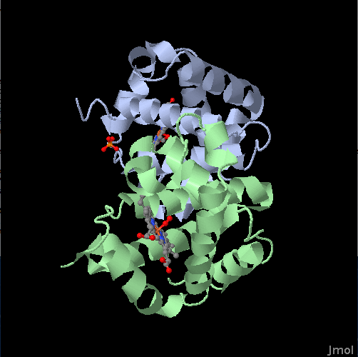
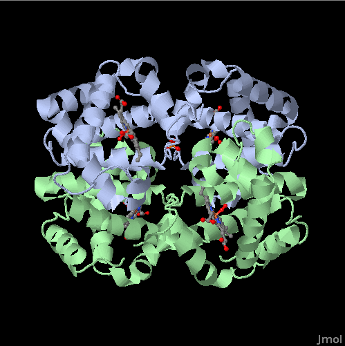
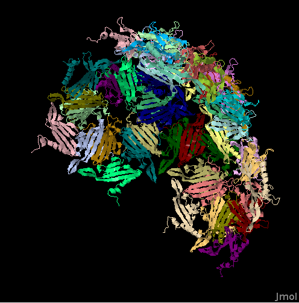
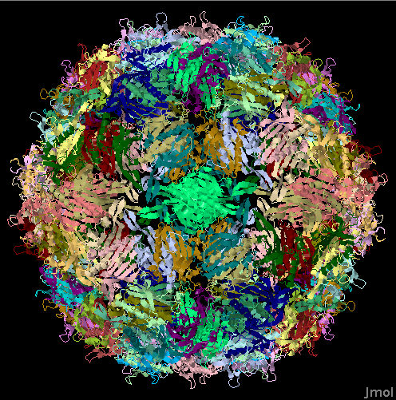
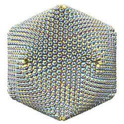

Asymmetric Unit and Biological Assembly
=======================================

For many proteins, the asymmetric unit and the biological assembly are the same. However there are quite a few proteins where they are not identical and depending on what you are interested in, it might be important that you work with the biological assembly, instead of the asymmetric unit.

## Asymmetric Unit

The asymmetric unit is the smallest portion of a crystal structure to which symmetry operations can be applied in order to generate the complete unit cell (the crystal repeating unit). 

A crystal asymmetric unit may contain:

* one biological assembly
* a portion of a biological assembly
* multiple biological assemblies

## Biological Assembly

The biological assembly (also sometimes referred to as the biological unit) is the macromolecular assembly that has either been shown to be or is believed to be the functional form of the molecule For example, the functional form of hemoglobin has four chains.

The StructureIO and AtomCache classes in Biojava provide access methods to work with either asymmetric unit or biological assembly.

Let's load both representations of hemoglobin PDB ID [1HHO](http://www.rcsb.org/pdb/explore.do?structureId=1hho) and visualize it:

<pre>
    public static void main(String[] args){

        try {
            Structure asymUnit = StructureIO.getStructure("1hho");

            showStructure(asymUnit);
            
            Structure bioAssembly = StructureIO.getBiologicalAssembly("1hho");
            
            showStructure(bioAssembly);
            
        } catch (Exception e){
            e.printStackTrace();
        }

    }

    public static void showStructure(Structure structure){

        StructureAlignmentJmol jmolPanel = new StructureAlignmentJmol();

        jmolPanel.setStructure(structure);

        // send some commands to Jmol
        jmolPanel.evalString("select * ; color chain;");            
        jmolPanel.evalString("select *; spacefill off; wireframe off; cartoon on;  ");
        jmolPanel.evalString("select ligands; cartoon off; wireframe 0.3; spacefill 0.5; color cpk;");

    }
</pre>

<table>
    <tr>
        <td>
            The <b>asymmetric unit</b> of hemoglobin PDB ID <a href="http://www.rcsb.org/pdb/explore.do?structureId=1hho">1HHO</a>
        </td>
        <td>
            The <b>biological assembly</b> of hemoglobin PDB ID <a href="http://www.rcsb.org/pdb/explore.do?structureId=1hho">1HHO</a>
        </td>
    </tr>
    <tr>
        <td>
            
        </td>
        <td>
            
        </td>
    </tr>
</table>

As we can see, the two representations are quite different! When investigating protein interfaces, ligand binding and for many other applications, you always want to work with the biological assemblies.

Here another example, the bacteriophave GA protein capsid PDB ID [1GAV](http://www.rcsb.org/pdb/explore.do?structureId=1gav)

<table>
    <tr>
        <td>
            The <b>asymmetric unit</b> of bacteriophave GA protein capsid PDB ID  <a href="http://www.rcsb.org/pdb/explore.do?structureId=1gav">1GAV</a>
        </td>
        <td>
            The <b>biological assembly</b> of bacteriophave GA protein capsid PDB ID  <a href="http://www.rcsb.org/pdb/explore.do?structureId=1gav">1GAV</a>
        </td>
    </tr>
    <tr>
        <td>
            
        </td>
        <td>
            
        </td>
    </tr>
</table>

## Re-creating Biological Assemblies

Since biological assemblies can be accessed via the StructureIO interface, in principle there is no need to access the lower-level code in BioJava that allows to re-create biological assemblies. If you are interested in looking at the gory details of this, here a couple of pointers into the code. In principle there are two ways for how to get to a biological assembly:

A) The biological assembly needs to be re-built and the atom coordinates of the asymmetric unit need to be rotated according to the instructions in the files. The information required to re-create the biological assemblies is available in both the PDB an mmCIF/PDBx files. 

In PDB files the relevant transformations are stored in the *REMARK 350* records. For mmCIF/PDBx, the *_pdbx_struct_assembly* and *_pdbx_struct_oper_list* categories store the corresponding rules.

B) There is also a pre-computed file available that contains an assembled version of a structure. This file can be parsed directly, without having to perform rotation operations on coordinates.

BioJava contains utility classes to re-create biological assemblies for both PDB and mmCIF, as well as to parse the pre-computed file. The [BioUnitDataProvider](http://www.biojava.org/docs/api/org/biojava/bio/structure/quaternary/io/BioUnitDataProvider.html) interface defines what is required to re-build an assembly. The [BioUnitDataProviderFactory](http://www.biojava.org/docs/api/org/biojava/bio/structure/quaternary/io/BioUnitDataProviderFactory.html) allows to specify which of the BioUnitDataProviders is getting used.

Take a look at the method getBiologicalAssembly() in [StructureIO](http://www.biojava.org/docs/api/org/biojava/bio/structure/io/StructureIO.html)  to see how the BioUnitDataProviders are used by the *BiologicalAssemblyBuilder*.

## Memory consumption

This next example loads the structure of the PBCV-1 virus capsid (PDB ID [1M4X](http://www.rcsb.org/pdb/explore.do?structureId=1m4x)). It has one of the largest, if not the largest biological assembly that is currently available in the PDB. It consists of 16 million atoms!

<table>
    <tr>
        <td>
          
        </td>       
    </tr>
    <tr>
        <td>
            The biological assembly of the PBCV-1 virus capsid. (image source: <a href="http://www.rcsb.org/pdb/explore.do?structureId=1m4x">RCSB</a>)
        </td>
    </tr>
</table>

To load the pre-assembled biological assembly file directly, one can tweak the low-level PDB file parser like this

<pre>
public static void main(String[] args){

        public static void main(String[] args){

        // This loads the PBCV-1 virus capsid, one of, if not the biggest biological assembly in terms on nr. of atoms.
        // The 1m4x.pdb1.gz file has 313 MB (compressed)
        // This Structure requires about 8 GB of memory to be loaded in memory. 

        String pdbId = "1M4X";

        Structure bigStructure = readStructure(pdbId,1);
        
        // let's take a look how much memory this consumes currently

        Runtime r = Runtime.getRuntime();

        // let's try to trigger the Java Garbage collector
        r.gc();

        System.out.println("Memory consumption after " + pdbId + 
                " structure has been loaded into memory:");
        
        String mem = String.format("Total %dMB, Used %dMB, Free %dMB, Max %dMB", 
                r.totalMemory() / 1048576,
                (r.totalMemory() - r.freeMemory()) / 1048576, 
                r.freeMemory() / 1048576,
                r.maxMemory() / 1048576);

        System.out.println(mem);
                
        System.out.println("# atoms: " + StructureTools.getNrAtoms(bigStructure));
        
    }
    /** Load a specific biological assembly for a PDB entry
     *  
     * @param pdbId .. the PDB ID
     * @param bioAssemblyId .. the first assembly has the bioAssemblyId 1
     * @return a Structure object or null if something went wrong.
     */
    public static Structure  readStructure(String pdbId, int bioAssemblyId) {

        // pre-computed files use lower case PDB IDs
        pdbId = pdbId.toLowerCase();

        // we need to tweak the FileParsing parameters a bit
        FileParsingParameters p = new FileParsingParameters();

        // some bio assemblies are large, we want an all atom representation and avoid
        // switching to a Calpha-only representation for large molecules
        // note, this requires several GB of memory for some of the largest assemblies, such a 1MX4
        p.setAtomCaThreshold(Integer.MAX_VALUE);

        // parse remark 350 
        p.setParseBioAssembly(true);

        // The low level PDB file parser
        PDBFileReader pdbreader = new PDBFileReader();

        // we just need this to track where to store PDB files
        // this checks the PDB_DIR property (and uses a tmp location if not set) 
        AtomCache cache = new AtomCache();
        pdbreader.setPath(cache.getPath());

        pdbreader.setFileParsingParameters(p);

        // download missing files
        pdbreader.setAutoFetch(true);

        pdbreader.setBioAssemblyId(bioAssemblyId);
        pdbreader.setBioAssemblyFallback(false);

        Structure structure = null;
        try { 
            structure = pdbreader.getStructureById(pdbId);
            if ( bioAssemblyId > 0 )
                structure.setBiologicalAssembly(true);
            structure.setPDBCode(pdbId);
        } catch (Exception e){
            e.printStackTrace();
            return null;
        }
        return structure;
    }
 </pre>

## Further Reading

The RCSB PDB web site has a great [tutorial on Biological Assemblies](http://www.rcsb.org/pdb/101/static101.do?p=education_discussion/Looking-at-Structures/bioassembly_tutorial.html).
