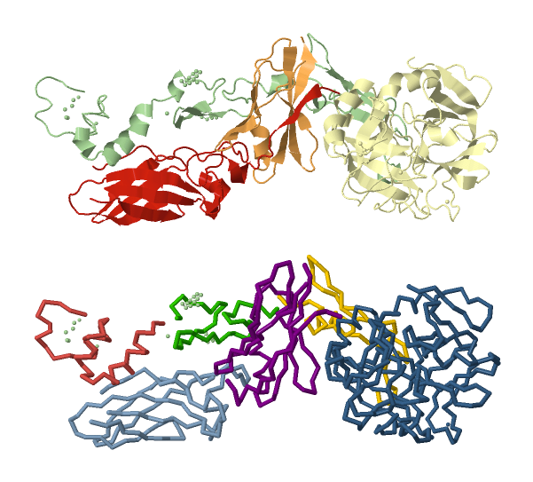
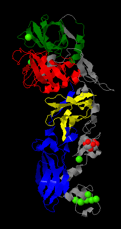

External Databases
==================

Biojava provides access to a number of external structural databases. These often use [caching](caching.md) to reduce the amount of data which must be downloaded from the database.

SCOP
----

<div style="float:right; margin-left:auto; border: grey 1px;">
	<br/>
	<p style="width:300px; font-size:80%;">(Top) The structure 1DAN contains four chains. (Bottom) These chains are broken up into six SCOP domains. The green chain L becomes 3 domains, while a combination of chains U (red) and T (orange) go to form the central purpal domain.</p>
</div>

The Structural Classification of Proteins (SCOP) is a manually curated classification of protein structural domains. It provides two pieces of data:

* The breakdown of a protein into structural domains
* A classification of domains according to their structure.

The structure for a known SCOP domain can be fetched via its 7-letter domain ID (eg 'd2bq6a1') via ```StructureIO.getStructure()```, as described in [Local PDB Installations](caching.md#Caching of other SCOP, CATH).

The SCOP classification can be accessed through the [```ScopDatabase```](http://www.biojava.org/docs/api/org/biojava/bio/structure/scop/ScopDatabase.html) class.

    ScopDatabase scop = ScopFactory.getSCOP();

### Inspecting SCOP domains

A list of domains can be retrieved for a given protein.

    List<ScopDomain> domains = scop.getDomainsForPDB("4HHB");

You can get lots of useful information from the [```ScopDomain```](http://www.biojava.org/docs/api/org/biojava/bio/structure/scop/ScopDomain.html) object. 

    ScopDomain domain = domains.get(0);
    String scopID = domain.getScopId(); // d4hhba_
    String classification = domain.getClassificationId(); // a.1.1.2
    int sunId = domain.getSunId(); // 15251

### Viewing the SCOP hierarchy

The full hierarchy is available as a tree of [```ScopNode```](http://www.biojava.org/docs/api/org/biojava/bio/structure/scop/ScopNode.html)s, which can be easily traversed using their ```getParentSunid()``` and ```getChildren()``` methods.

    ScopNode node = scop.getScopNode(sunId);
    while (node != null){
        System.out.println(scop.getScopDescriptionBySunid(node.getSunid()));
        node = scop.getScopNode(node.getParentSunid());
    }

ScopDatabase also provides access to all nodes at a particular level.

    List<ScopDescription> superfams = scop.getByCategory(ScopCategory.Superfamily);
    System.out.println("Total nr. of superfamilies:" + superfams.size());

### Types of ScopDatabase

Several types of ```ScopDatabase``` are available. These can be instantiated manually when more control is needed.

* __RemoteScopInstallation__ (default) Fetches data one node at a time from the internet. Useful when perfoming a small number of operations.
* __ScopeInstallation__ Downloads all SCOP data as a batch and caches it for later use. Much faster when performing many operations.

Several internal BioJava classes use ```ScopFactory.getSCOP()``` when they encounter references to SCOP domains, so it is always a good idea to notify the ```ScopFactory``` when using a custom ```ScopDatabase``` instance.

    ScopDatabase scop = new ScopInstallation();
    ScopFactory.setScopDatabase(scop);

Several versions of SCOP are available.

    // Use Steven Brenner's updated version of SCOP
    scop = ScopFactory.getSCOP(ScopFactory.VERSION_1_75C);
    // Use an old version globally, perhaps for an older benchmark
    ScopFactory.setScopDatabase(ScopFactory.VERSION_1_69);

CATH
----

Cath can be accessed in a very similar fashion to SCOP. In parallel to the ScopInstallation class, there is a CathInstallation. Also, the StructureIO class allows to request by CATH ID. 

```java

        private static final String DEFAULT_SCRIPT ="select * ; cartoon on; spacefill off; wireframe off; select ligands; wireframe on; spacefill on;";
        
        private static final String[] colors = new String[]{"red","green","blue","yellow"};
    
    public static void main(String args[]){
        
        UserConfiguration config = new UserConfiguration();
        config.setPdbFilePath("/tmp/");

        String pdbID = "1DAN";
        
        CathDatabase cath = new CathInstallation(config.getPdbFilePath());
        
        List<CathDomain> domains = cath.getDomainsForPdb(pdbID);
        
        try {
            
            // show the structure in 3D
            BiojavaJmol jmol = new BiojavaJmol();           
            jmol.setStructure(StructureIO.getStructure(pdbID));         
            jmol.evalString(DEFAULT_SCRIPT);
            
            System.out.println("got " + domains.size() + " domains");
            
            // now color the domains on the structure
            int colorpos = -1;
            
            for ( CathDomain domain : domains){             

                colorpos++;
                
                showDomain(jmol, domain,colorpos);
            }
                
            
        } catch (Exception e) {
            // TODO Auto-generated catch block
            e.printStackTrace();
        } 
        
    }

    
    
    private static void showDomain(BiojavaJmol jmol, CathDomain domain, int colorpos) {
        List<CathSegment> segments = domain.getSegments();
        
        StructureName key = new StructureName(domain.getDomainName());
        String chainId = key.getChainId();
        
        String color = colors[colorpos];
        
        System.out.println(" * domain " + domain.getDomainName() + " has # segments: " + domain.getSegments().size() + " color: " + color);
        
        for ( CathSegment segment : segments){
            System.out.println("   * " + segment);
            String start = segment.getStart();
            
            String stop = segment.getStop();
                        
            String script = "select " + start + "-" + stop+":"+chainId + "; color " + color +";";
            
            jmol.evalString(script );
        }
        
    }
 ```       

This will show the following


and the text:
```            
got 4 domains
 * domain 1danH01 has # segments: 2 color: red
   * CathSegment [segmentId=1, start=16, stop=27, length=12, sequenceHeader=null, sequence=null]
   * CathSegment [segmentId=2, start=121, stop=232, length=112, sequenceHeader=null, sequence=null]
 * domain 1danH02 has # segments: 2 color: green
   * CathSegment [segmentId=1, start=28, stop=120, length=93, sequenceHeader=null, sequence=null]
   * CathSegment [segmentId=2, start=233, stop=246, length=14, sequenceHeader=null, sequence=null]
 * domain 1danU00 has # segments: 1 color: blue
   * CathSegment [segmentId=1, start=91, stop=210, length=120, sequenceHeader=null, sequence=null]
 * domain 1danT00 has # segments: 1 color: yellow
   * CathSegment [segmentId=1, start=6, stop=80, length=75, sequenceHeader=null, sequence=null]
```

<table>
    <tr>
        <td>

        </td>
        <td>
            <pre>


            </pre>
        </td>
    </tr>
    <tr></tr>
</table>

   
