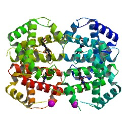
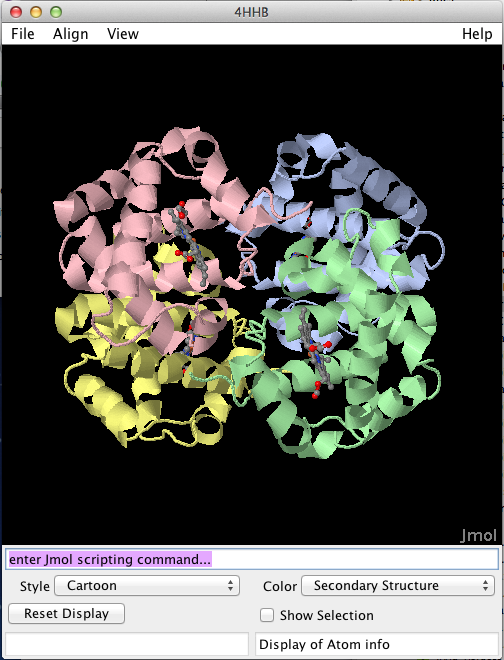

First Steps
===========

## First steps

The simplest way to load a PDB file is by using the [StructureIO](http://www.biojava.org/docs/api/org/biojava3/structure/StructureIO.html) class.

```java
     public static void main(String[] args){
        try {
                Structure structure = StructureIO.getStructure("4HHB");
                // and let's print out how many atoms are in this structure
                System.out.println(StructureTools.getNrAtoms(structure));
            } catch (Exception e){
                e.printStackTrace();
        }
    }   
```

BioJava  automatically downloads the PDB file for hemoglobin [4HHB](http://www.rcsb.org/pdb/explore.do?structureId=4HHB) and copies it into a temporary location. Then the PDB file parser loads the data into a [Structure](http://www.biojava.org/docs/api/org/biojava/bio/structure/Structure.html) object, that provides access to the content in the file. (If you call this a second time, BioJava will automatically re-use the local file.)

<table>
    <tr>
        <td>
            <a href="http://www.rcsb.org/pdb/explore.do?structureId=4hhb"></a>
        </td>
        <td>
            The crystal structure of human deoxyhaemoglobin PDB ID <a href="http://www.rcsb.org/pdb/explore.do?structureId=4hhb">4HHB</a> (image source: <a href="http://www.rcsb.org/pdb/explore.do?structureId=4hhb">RCSB</a>)
    </tr>
</table>

This demonstrates two things:

+ BioJava can automatically download and install files locally (more on this in Chapter 4)
+ BioJava by default writes those files into a temporary location (The system temp directory "java.io.tempdir"). 

If you already have a local PDB installation, you can configure where BioJava should read the files from by setting the PDB_DIR system property

<pre>
    -DPDB_DIR=/wherever/you/want/
</pre>

## Memory consumption

Talking about startup properties, it is also good to mention the fact that many PDB entries are large molecules and the default 64k memory allowance for Java applications is not sufficient in many cases.  BioJava contains several built-in caches which automatically adjust to the available memory. As such, the more memory you grant your Java applicaiton, the better it can utilize the caches and the better the performance will be. Change the maximum heap space of your Java VM with this startup parameter:

<pre>
    -Xmx1G
</pre>

## A Quick 3D View

If you have the *biojava-structure-gui* module installed, you can quickly visualise a [Structure](http://www.biojava.org/docs/api/org/biojava/bio/structure/Structure.html) via this:

```java
    public static void main(String[] args){
        try {
            
            Structure struc = StructureIO.getStructure("4hhb");

            StructureAlignmentJmol jmolPanel = new StructureAlignmentJmol();

            jmolPanel.setStructure(struc);

            // send some commands to Jmol
            jmolPanel.evalString("select * ; color chain;");            
            jmolPanel.evalString("select *; spacefill off; wireframe off; cartoon on;  ");
            jmolPanel.evalString("select ligands; cartoon off; wireframe 0.3; spacefill 0.5; color cpk;");
            
        } catch (Exception e){
            e.printStackTrace();
        }
    }
```

This will result in the following view:

<table>
    <tr>
        <td>
            
        </td>
        <td>
            The <a href="http://www.biojava.org/docs/api/org/biojava/bio/structure/align/gui/jmol/StructureAlignmentJmol.html">StructureAlignmentJmol</a> class provides a wrapper for the <a href="http://jmol.sourceforge.net/">Jmol</a> viewer and provides a bridge to BioJava, so Structure objects can be sent to Jmol for visualisation.
        </td>
    </tr>
</table>   

## Asymmetric unit and Biological Assembly

By default many people work with the *asymmetric unit* of a protein. However for many studies the correct representation to look at is the *biological assembly* of a protein. You can request it by calling

```java
     public static void main(String[] args){

        try {
                Structure structure = StructureIO.getBiologicalAssembly("1GAV");
                // and let's print out how many atoms are in this structure
                System.out.println(StructureTools.getNrAtoms(structure));
        } catch (Exception e){
                e.printStackTrace();
        }
    }
```

This topic is important, so we dedicated a [whole chapter](bioassembly.md) to it.

## I loaded a Structure object, what now?

BioJava provides a number of algorithms and visualisation tools that you can use to further analyse the structure, or look at it. Here a couple of suggestions for further reads:

+ [The BioJava Cookbook for protein structures](http://biojava.org/wiki/BioJava:CookBook#Protein_Structure)
+ How does BioJava [represent the content](structure-data-model.md) of a PDB/mmCIF file?
+ [How to calculate a protein structure alignment using BioJava](http://biojava.org/wiki/BioJava:CookBook:PDB:align)
+ [How to work with Groups (AminoAcid, Nucleotide, Hetatom)](http://biojava.org/wiki/BioJava:CookBook:PDB:groups)


<!--automatically generated footer-->

---

Navigation:
[Home](../README.md)
| [Book 3: The Protein Structure modules](README.md)
| Chapter 2 : First Steps

Prev: [Chapter 1 : Installation](installation.md)

Next: [Chapter 3 : data model](structure-data-model.md)
