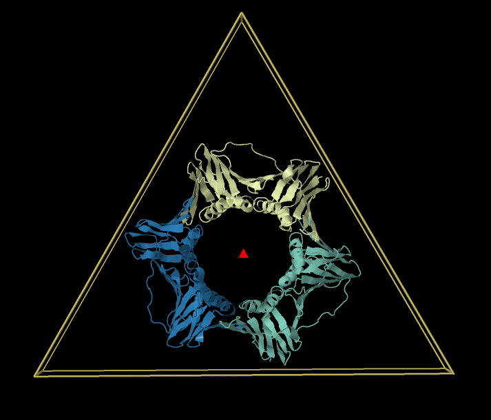
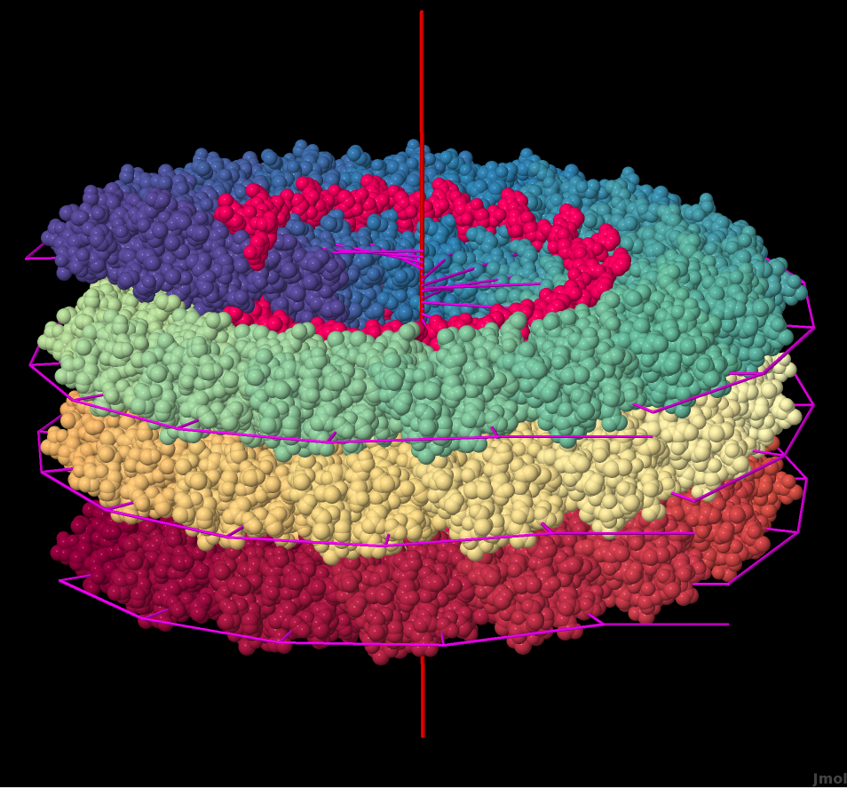
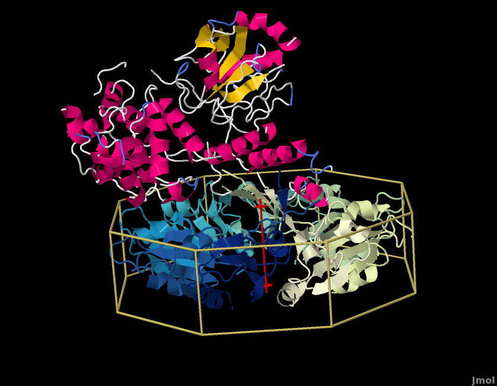
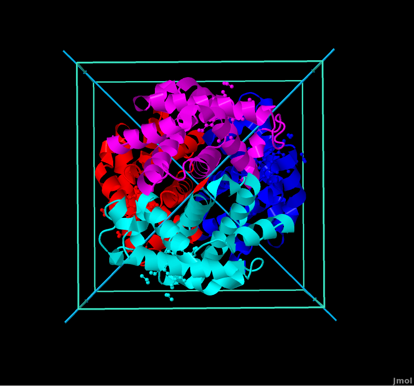
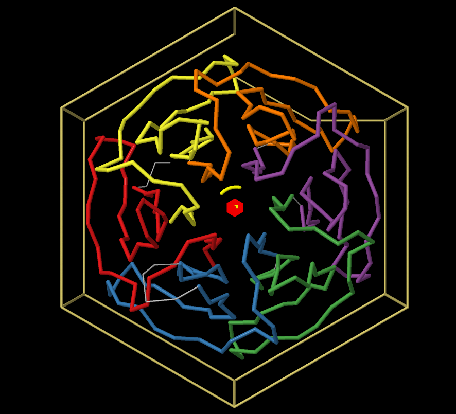
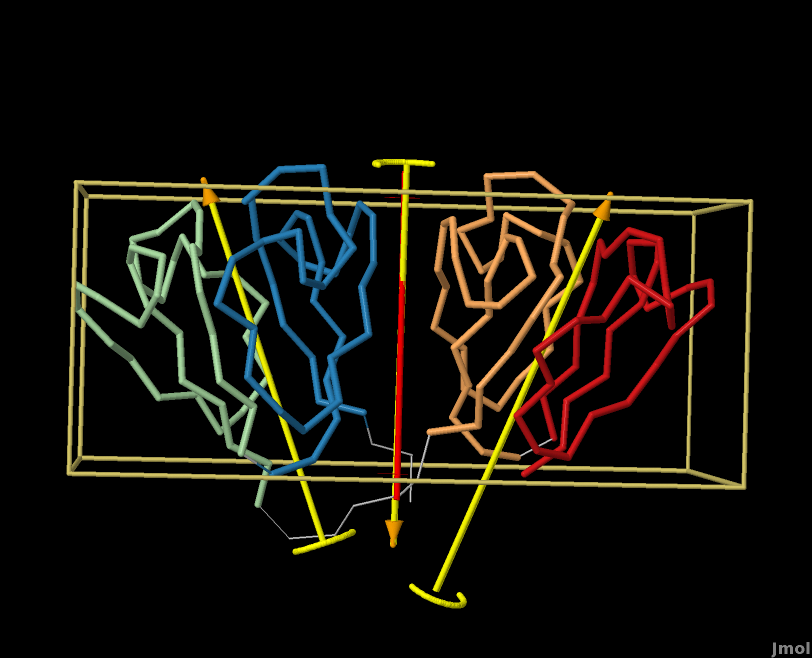
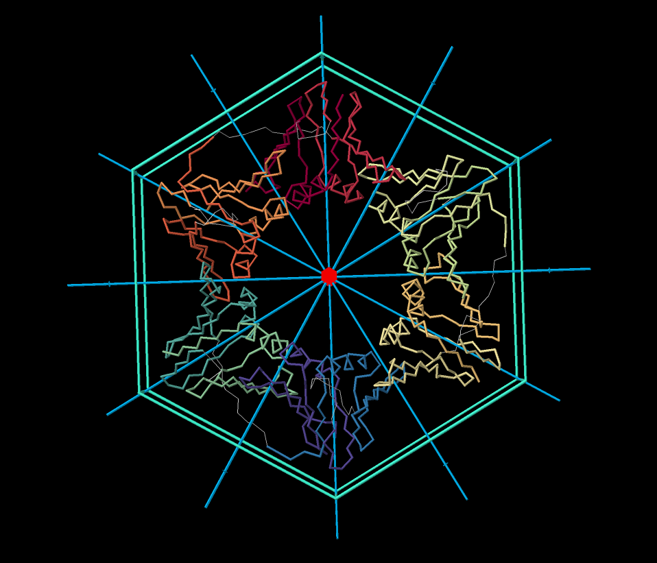

Protein Symmetry using BioJava
================================================================

BioJava can be used to detect, analyze, and visualize **symmetry** and 
**pseudo-symmetry** in the **quaternary** (biological assembly) and tertiary 
(**internal**) structural levels.

## Quaternary Symmetry

The **quaternary symmetry** of a structure defines the relations between 
its individual chains or groups of chains. For a more extensive explanation 
about symmetery visit the [PDB help page]
(http://www.rcsb.org/pdb/staticHelp.do?p=help/viewers/jmol_symmetry_view.html).

In the **quaternary symmetry** detection problem, we are given a set of chains
with its `Atom` coordinates and we are asked to find the higest overall symmetry that
relates them. The solution is divided into the following steps:

1. First, we need to identify the chains that are identical (or similar
in the pseudo-symmetry case). For that, we perform a pairwise alignment of all
chains and determine **clusters of identical chains**.
2. Next, we reduce the each chains to a single point, its **centroid** (center of mass).
3. After that, we try different **symmetry relations** to superimpose the chain centroids 
and obtain their RMSD.
4. At last, based on the parameters (cutoffs), we determine the **overall symmetry** of the
structure, with the symmetry relations obtained in the previous step.
5. In case of asymmetric structure, we discard combinatorially a number of chains and try
to detect any **local symmetries** present.

The **quaternary symmetry** detection algorithm is implemented in the biojava class
[QuatSymmetryDetector](http://www.biojava.org/docs/api/org/biojava/nbio/structure/symmetry/core/QuatSymmetryDetector).
An example of how to use it programatically is shown below:

```java
//First download the structure in the biological assembly form
Structure s;

//Set some parameters if needed different than DEFAULT - see descriptions
QuatSymmetryParameters parameters = new QuatSymmetryParameters();
parameters.setVerbose(true); //print information

//Instantiate the detector and calculate symmetry
CalcBioAssemblySymmetry calc = new CalcBioAssemblySymmetry(s, parameters);
QuatSymmetryDetector detector = calc.orient();

//Calculate and return global and local results
List<QuatSymmetryResults> globalResults = detector.getGlobalSymmetry();
List<List<QuatSymmetryResults>> localResults = detector.getLocalSymmetries();

```

The `QuatSymmetryResults` object contains all the information of the symmetry.
This object will be used later to obtain axes of symmetry, point group name,
stoichiometry or even display the results in Jmol.

### Global Symmetry

In **global symmetry** all chains have to be part of the symmetry description.

#### Point Group

In a **point group** a single or multiple rotation axes define the overall symmetry
operations, with the property that all the axes coincide in the same point.



#### Helical

In **helical** symmetry there is a single axis with rotation and translation
components.



### Local Symmetry

In **local symmetry** a number of chains is left out, so that the symmetry
only applies to a subset of chains.



### Pseudo-Symmetry

In **pseudo-symmetry** the chains related by the symmetry are not completely
identical, but they share a sequence similarity above the pseudo-symmetry 
similarity threshold.

If we consider hemoglobin, at a 95% sequence identity threshold the alpha and 
beta subunits are considered different, which correspond to an A2B2 stoichiometry 
and a C2 point group. At the structural similarity level, all four chains are 
considered homologous (~45% sequence identity) with an A4 pseudostoichiometry and 
D2 pseudosymmetry. 



## Internal Symmetry

**Internal symmetry** refers to the symmetry present in a single chain, that is, 
the tertiary structure. The algorithm implemented in biojava to detect internal 
symmetry is called **CE-Symm**.

### CE-Symm

As the name of the algorithm explicitly states, **CE-Symm** uses a **CE** alignment
of the structure chain to itself, disabling the identity alignment (the diagonal of
the **DotPlot** representation of a structure alignment). This allows the identification 
of alternative self-alignments, which are related to symmetry and/or structural repeats
inside the chain.

By a procedure called **refinement**, the subunits of the chain that are part of the symmetry 
are defined and a **multiple alignment** is created. This process can be thought as to
divide the chain into other subchains, and then superimposing each subchain to each other to
create a multiple alignment of the subunits, respecting the symmetry axes.

The **internal symmetry** detection algorithm is implemented in the biojava class
[CeSymm](http://www.biojava.org/docs/api/org/biojava/nbio/structure/symmetry/internal/CeSymm).
It implements the both [Structural Alignment](alignment.md) interfaces, so it works programatically
like any of the structural alignment algorithms, and returns one of the structure alignment 
[Data Models](alignment-data-model.md). 

```java
//Prepare the atom input, in a List with a single array
Atom[] array = StructureTools.getRepresentativeAtomArray(structure);
List<Atom[]> atoms = new ArrayList<Atom[]>();
atoms.add(array);

//Initialize the algorithm
CeSymm ceSymm = new CeSymm();

//Choose some parameters
CESymmParameters params = (CESymmParameters) ceSymm.getParameters();
params.setRefineMethod(RefineMethod.SINGLE);
params.setOptimization(true);
params.setMultipleAxes(true);

//Run the symmetry analysis - alignment as an output
MultipleAlignment symmetry = ceSymm.align(atoms, params);

//Get the axes of symmetry from the aligner
SymmetryAxes axes = ceSymm.getSymmetryAxes();

//Display the results in jmol with the Symmetry GUI
SymmetryDisplay.display(symmetry, axes);
```

To enable some extra features in the display, a `SymmetryDisplay`
class has been created, although the `StrucutreAlignmentDisplay`
and `MultipleAlignmentDisplay` methods can also be used for that
purpose (they will not show symmetry axes or symmetry menus).

Lastly, the `SymmetryGUI` class in the **structure-gui** package
provides a GUI to trigger internal symmetry analysis, equivalent
to the GUI to trigger structure alignments.

### Symmetry Display

The symmetry display is similar to the **quaternary symmetry**, because
part of the code is shared. See for example this beta-propeller (1U6D), 
where the repeated beta-sheets are connected by a linker forming a C6
point group internal symmetry:



#### Hierarchical Symmetry

One additional feature of the **internal symmetry** display is the representation
of hierarchical symmetries and repeats. Contrary to point groups, some structures 
have different **levels** of symmetry. That is, the whole strucutre has, e.g. C2 
symmetry and, at the same time, each of the two parts has C2 symmetry, but the axes 
of both levels are not related by a point group (i.e. they do not cross to a single 
point).

A very clear example are the beta-gamma-crystallins, like 4GCR:



#### Subunit Multiple Alignment

Another feature of the display is the option to show the **multiple alignment** of 
the symmetry related subunits created during the **refinement** process. Search for
the option *Subunit Superposition* in the *symmetry* menu of the Jmol window. For 
the previous example the display looks like that:


The subunit display highlights the differences and similarities between the symmetry 
related subunits of the chain, and helps the user to identify conseved and divergent
regions, with the help of the *Sequence Alignment Panel*.

## Combined Global Symmetry

Finally, the internal and quaternary symmetries can be combined to obtain the global
overall combined symmetry. As we have seen before, the protein 1VYM is a DNA-clamp that
has three chains relates by C3 symmetry. Each chain is internally C2 symmetric, and each 
part of the C2 internal symmetry is C2 symmetric, so a case of **hierarchical symmetry** 
(C2 + C2). Once we have divided the whole structure into its asymmetric parts, we can 
analyze the global symmetry that related each one of them. The interesting result is that
in some cases, the internal symmetry **multiplies** the point group of the quaternary symmetry.
What seemed a C3 + C2 + C2 is combined into a D6 overall symmetry, as we can see in the figure
below:



This results can gives hints about the function and evolution of proteins and biological
structures.

<!--automatically generated footer-->

---

Navigation:
[Home](../README.md)
| [Book 3: The Structure Modules](README.md)
| Chapter 14 : Protein Symmetry

Prev: [Chapter 13 - Finding all Interfaces in Crystal: Crystal Contacts](crystal-contacts.md)

Next: [Chapter 16 : Special Cases](special.md)
